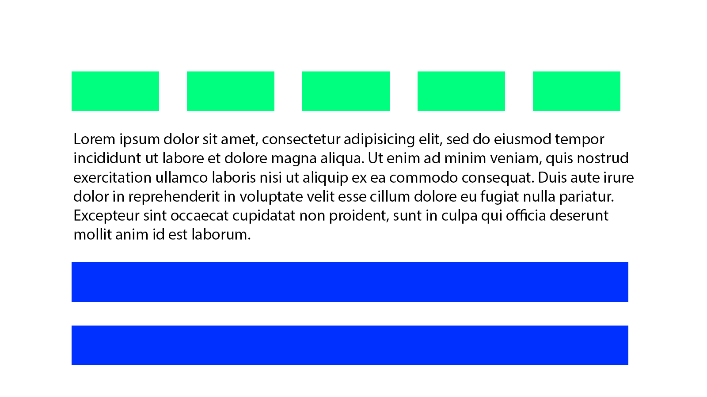
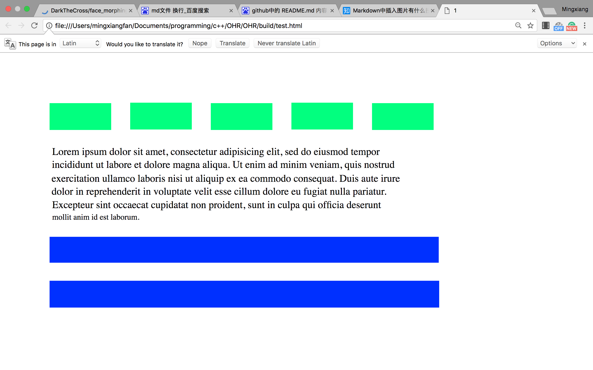

This is a project that changes images to webpages.

# current work
supports rectangle-shaped region recognition and English characters recognition.

#example
we can generate a webpage like    
    
from the image    
    
and more examples could be found in the /img folder.    

# dependencies
opencv3, tesseract